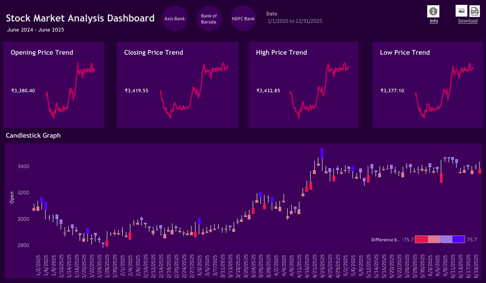
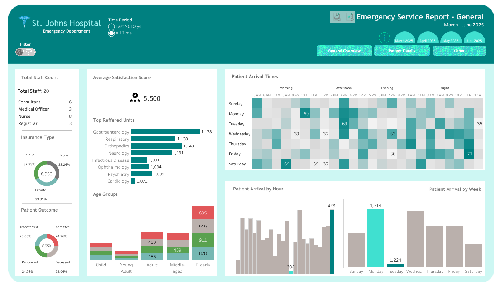
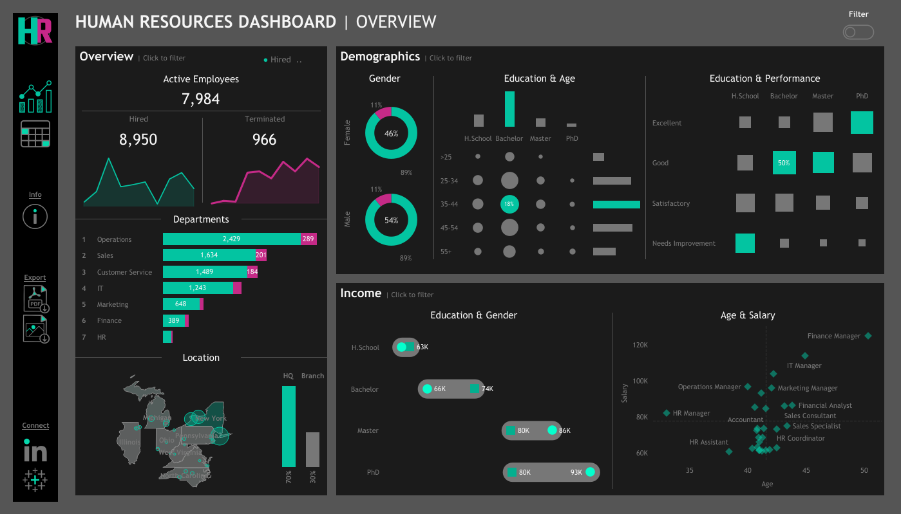
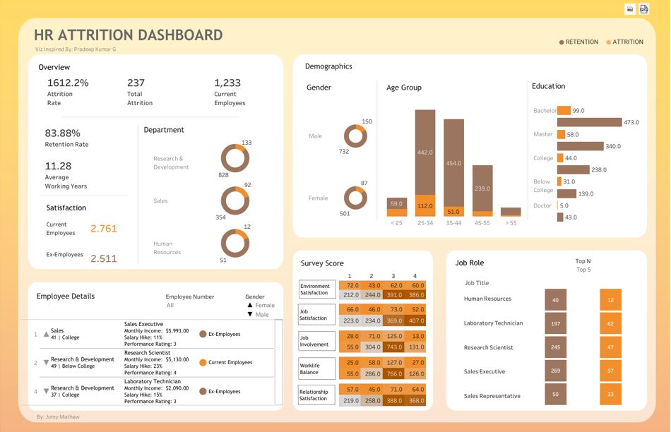
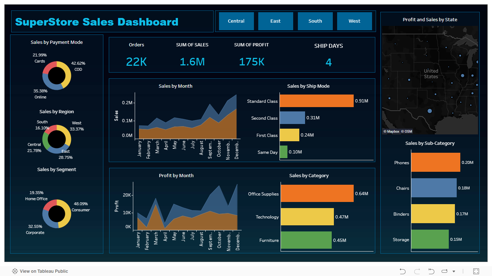
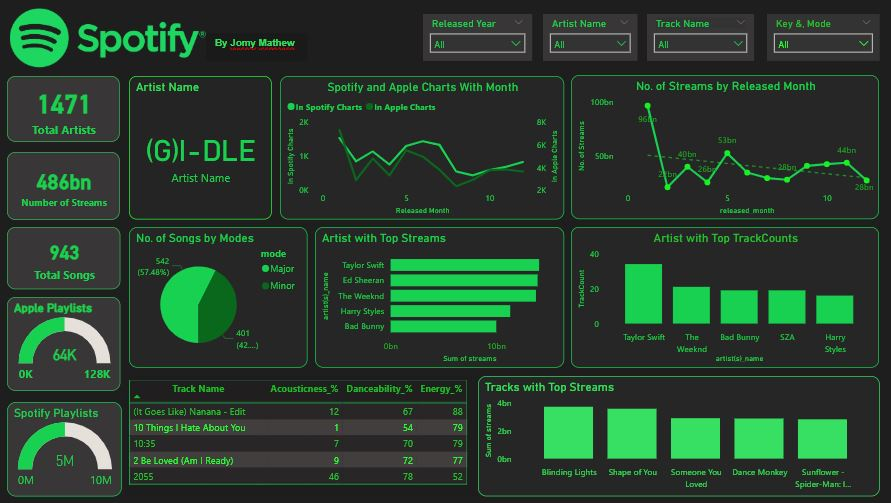

# 👋 Hi, I'm Jomy Mathew 

I'm a data analyst and GenAI enthusiast passionate about transforming data into insights and intelligent solutions. I work at the intersection of **data visualization** and **AI**, building tools that are practical, scalable, and impactful.

---

## 💡 What I Do

- 📊 I specialize in crafting compelling **Tableau dashboards** to reveal actionable business insights.
- 🤖 Build intelligent apps using **LLMs**, **LangChain**, and **HuggingFace Transformers** – from chatbots to summarizers and translators.
- ⚙️ I develop scalable solutions using open-source tools and frameworks for real-world applications.
- 🧠 I enjoy creating full-stack AI pipelines that combine **data analysis**, **machine learning**, and **generative AI**.

---

## ⚖️ Featured Project: Verdict AI  

**Verdict AI** is an AI-powered Legal Intelligence Platform designed to make legal research faster, smarter, and multilingual.

🔹 Core Features:
- 🧑‍⚖️ **Legal AI Chatbot** – Answers queries using IPC, Cyber Laws, Labour Laws, etc.  
- 📄 **Document Summarizer** – Summarizes lengthy legal PDFs and scanned documents.  
- 🔍 **Relevant Case Finder** – Uses FAISS and semantic search to recommend Supreme Court cases from 48K+ documents.  
- 🌐 **Legal Document Translator** – Translates legal documents from English to Indian languages (Hindi, Marathi, Tamil, and more).

🔗 [Explore Verdict AI on GitHub »](https://github.com/Jo-Mathew/Verdict-AI)

---

## 📊 Tableau Dashboards

Here are a few of my Tableau dashboards, each designed to tell a data story with clarity and purpose:

<table>
  <tr>
    <td>
      
    </td>
    <td>
      
    </td>
    <td>
      
    </td>
    <td>
      
    </td>
  </tr>
  <tr>
    <td>
      
    </td>
    <td></td>
    <td></td>
  </tr>
</table>

---

## 📊 Power BI Dashboards

Here are a few of my PowerBI dashboards, each designed to tell a data story with clarity and purpose:

<table>
  <tr>
    <td>
      
    </td>
    
  </tr>
</table>

---

## 🛠️ Skills

**Programming Languages: Python, SQL, R, C++**  
**AI/ML & GenAI Tools**  
**Data Analysis & Visualization**  
**Machine Learning & Deep Learning**  

---

